# Versionator3k - Git for Unity


<br>

[](https://u3d.as/3aVX)

<br>

Git integration for Unity projects, all basic tools inside the editor

Github Repository: https://github.com/meaf75/Versionator3k

⚠ **Plugin under development**: I'm still working on this project :construction_worker: so be careful using it on larger projects and feel free to contribute it 🚧🚧

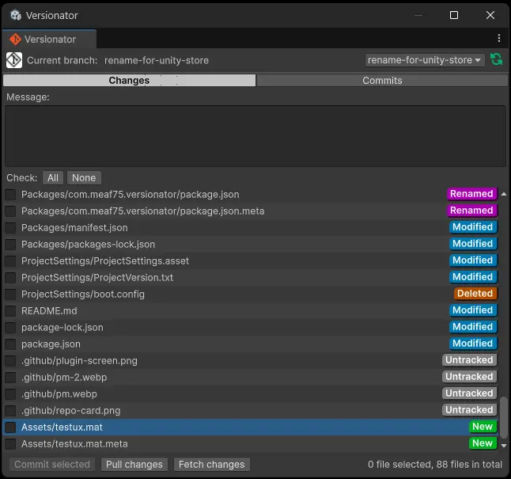
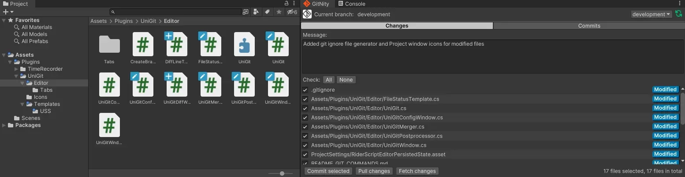

<div class="page-break"></div>

# Features
Unchecked means To Do
- [x] List changes (Modified, untracked, new, merge error)
- [x] Commit files by selecting them
- [x] Push pending commits
- [x] Fetch changes
- [x] Pull changes
- [x] Create & switch branch
- [x] Display git commits, filter by branch
- [x] Context Menu on right click on an asset
- [x] Generate .gitignore
- [x] Draw status icon on files with modifications or tracked by git
- [x] Private ssh key support
- [x] Draw icon for ignored files/folders
- [ ] Merge tool or open X file with the script editor assigned in preferences
- [ ] LSF support
- [ ] Git Stash & Git stash pop/apply

# Table of content
- [Requirements](#requirements)
- [Installation](#installation)
    - [From git Url](#from-a-git-url)
    - [From this repo](#from-this-repo)
- [Instructions](#instructions)
    - [Configuration](#configuration)
    - [Versionator3k window](#versionator3k-window)
        - [Branching](#branching)
        - [Commits tab](#commits-tab)
        - [Diff window](#diff-window)
- [Commands used](#git-commands-used)

# Requirements
- You must have the git command line tools registered in your system path, you can install it at https://git-scm.com/download.
- Unity 2021.3.x

<div class="page-break"></div>

# Installation
## From a git url
You can install this plugin via assets manager from a git url

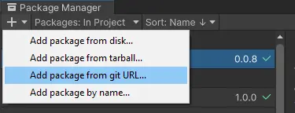
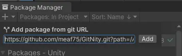

More information at: https://docs.unity3d.com/Manual/upm-ui-giturl.html

```
https://github.com/meaf75/Versionator3k.git?path=/Assets/Plugins/Versionator3k
```
## From this repo
Copy the content of this repository located at [Assets/Plugins](./Assets/Plugins/Versionator3k/) inside a folder in your unity project located at the same route

<div class="page-break"></div>

# Instructions

## Configuration
- All windows are located under Tools/Versionator3k.

    

- Configuration window allows you setup repository information (Tools/Versionator3k/Versionator3k Config).

    

- Make sure your project is a git repository if not then you can initialize your project from the config window (Tools/Versionator3k/Versionator3k Config).

    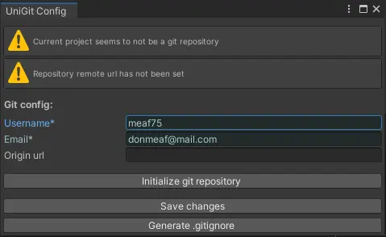

- You can also set a ssh key path to authenticate with your private repository by setting the private ssh key path.

    

## Versionator3k window
- First you will need to select the files you want to commit, you can do it by selecting the files in the Versionator3k window (Tools/Versionator3k/Versionator3k Window), add a commit message and add a commit message, finally you have to click the "Commit selected" button, this action will add selected items and commit them.

    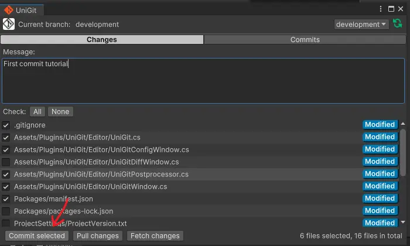

- After commit your files the final step is push your commit, when you have commits without push a "push" button will apear next to the "Commit selected" button, click it to push your pending commits, this action will make the selected files to disappear from the list don't worry they are staged with the new commit.

    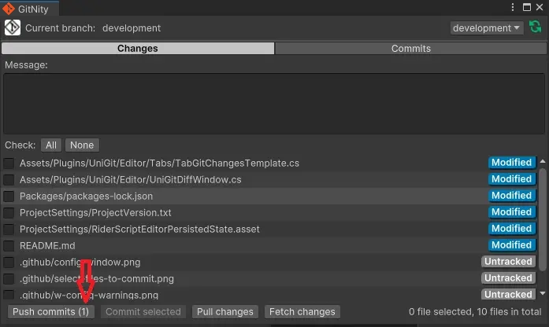

<div class="page-break"></div>

- Icons will be drawn over the project assets to represent their git status inside unity
    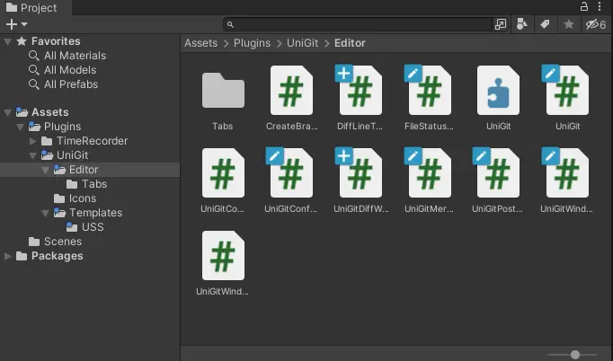
    | Status        | Icon |
    | -----------   | ----------- |
    | Deleted       |  |
    | Modified      |  |
    | Type changed  |  |
    | Renamed       |  |
    | Copied        |  |
    | New           |  |
    | Unknown       |  |
    | Ignored       |  |

- Context menu, if you right click over a element in the list of tracked files a pop up will appear with some useful actions
    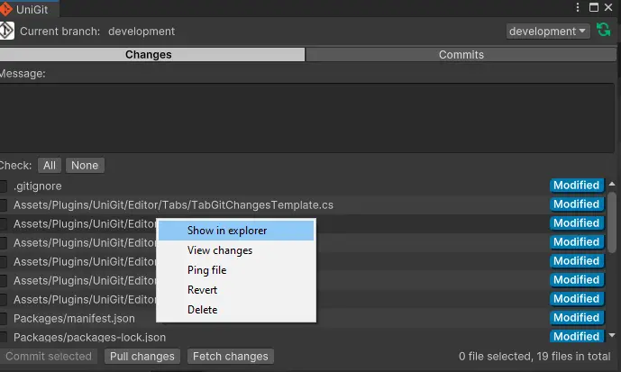

### Branching
- branching, you can switch between git branches by clicking over the drop down at the top right corner of the Versionator3k window, all tracked branches will be displayed as value in the dropdown menu
    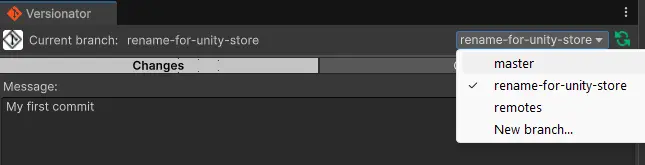

- you can also create a new branch by selecting "New branch..." option in the branch dropdown.
    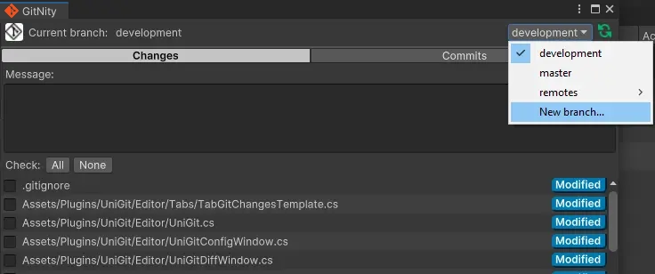

    this action will make apear a window where you can set the information for the new branch
    
    

### Commits tab
- You can list the commits made in a specific branch by selecting the "Commits" tab in the Versionator3k window

    

### Diff window 
- You can see the changes that you made from a specific file by right clicking over a file in the ListView and selecting "View changes"

    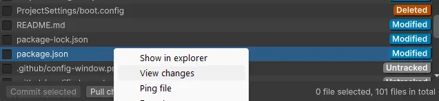
    This action will open a window to display all the changes for the selected file

    

# Git commands used
You can find a full list of all the git commands used on this project at [README_GIT_COMMANDS.md](./README_GIT_COMMANDS.md)
